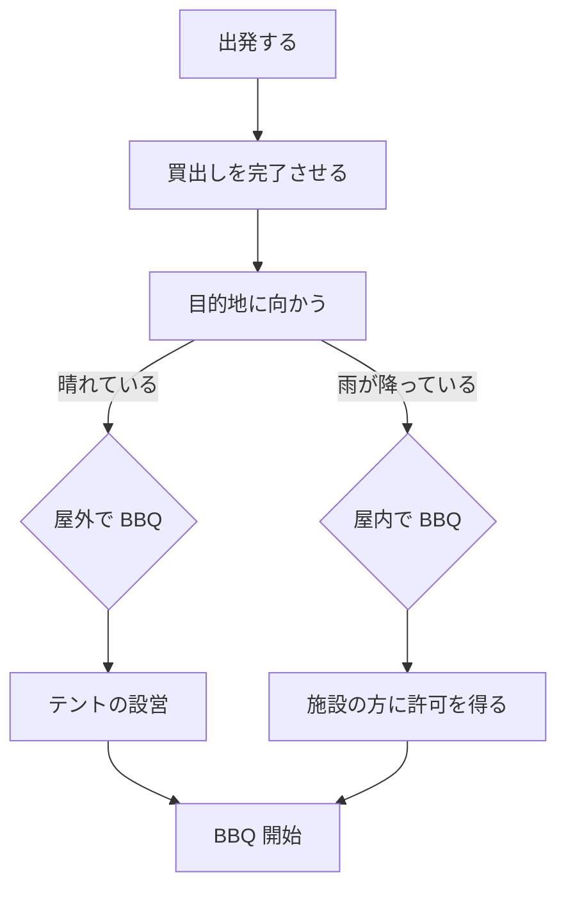

# chair_detector

椅子検出用パッケージ

```mermaid
flowchart TB;
A[出発する] --> B[買出しを完了させる];
B --> C[目的地に向かう];
C -- 晴れている --> D{屋外で BBQ};
C -- 雨が降っている --> E{屋内で BBQ};
D --> F[テントの設営];
E --> G[施設の方に許可を得る];
F --> H[BBQ 開始]
G --> H[BBQ 開始]
```
